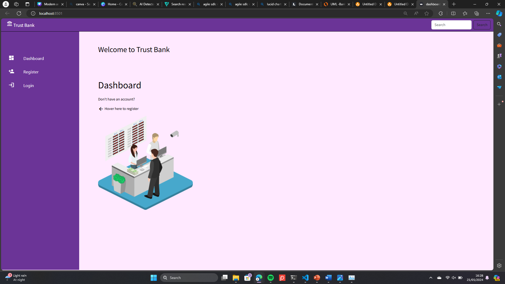
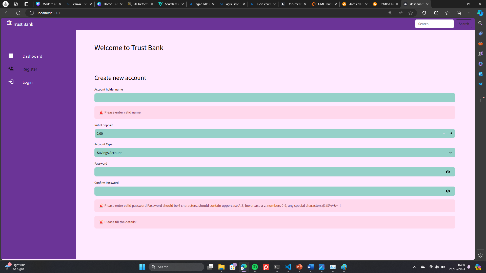
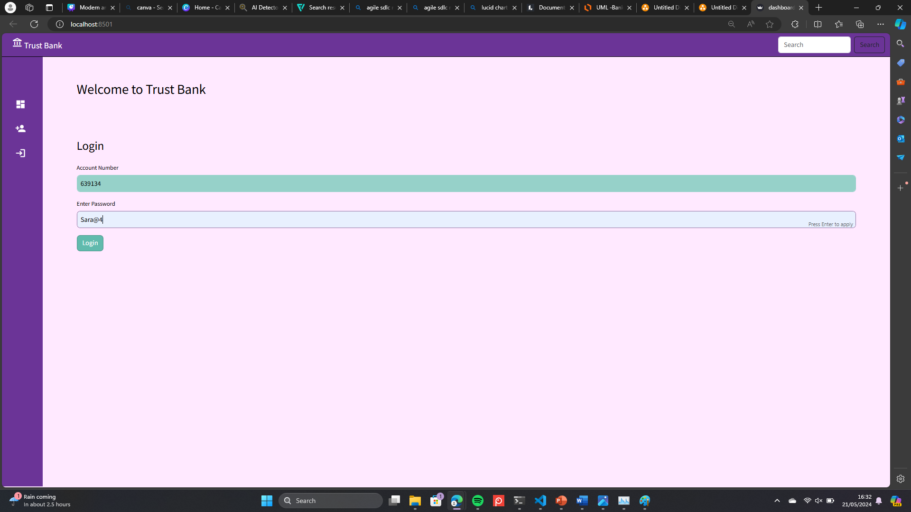
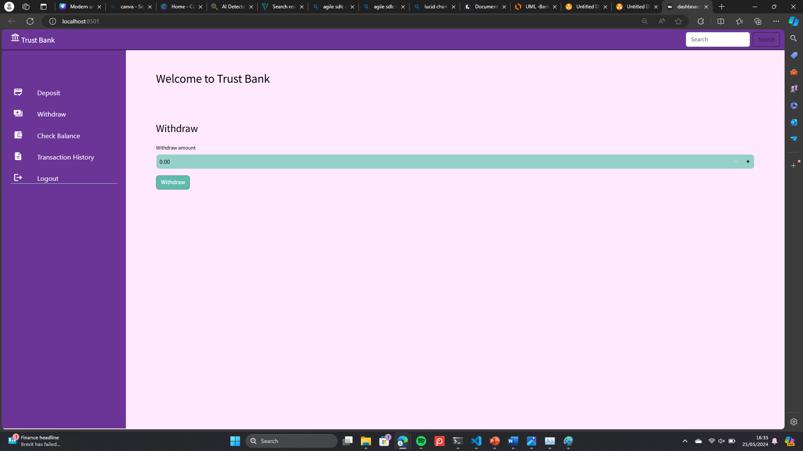
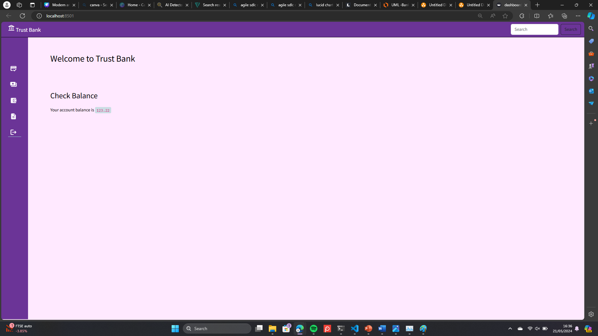
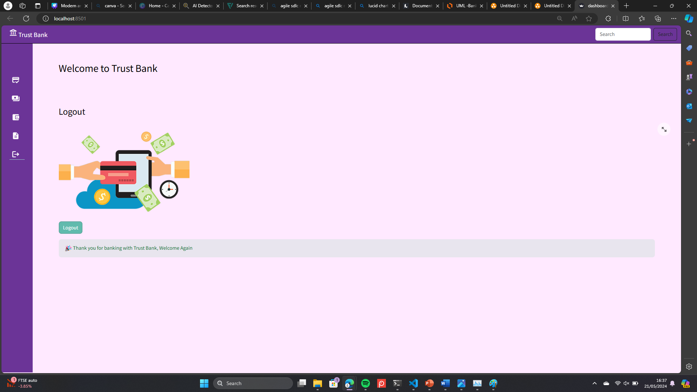

# Banking Application using OOP in Python with Streamlit

## Overview
This project is a **Banking Application** built using **Object-Oriented Programming (OOP)** concepts in Python and a simple UI using **Streamlit**.

The application allows users to:
- Create accounts
- Deposit money
- Withdraw money
- Check balance
- View Transaction History
- Login/Logout

It demonstrates core OOP principles:
- Abstraction
- Encapsulation
- Inheritance
- Polymorphism

---

## Features
- Create Bank Account
- Deposit Money
- Withdraw Money
- View Account Balance
- Secure balance handling (Encapsulation)
- Modular design using OOP
- Login/Logout
- Python packaging concepts

---

## OOP Concepts Used

### Abstraction
- Abstract base class `Account`
- Defines common methods like `deposit()`, `withdraw()`, `get_balance()`

### Encapsulation
- Balance is kept **private**
- Accessed using methods only

### Inheritance
- `SavingsAccount` and `CurrentAccount` inherit from `Account`

### Polymorphism
- Different behavior of `withdraw()` method in each account type

---

## Technologies Used
- Python 3
- Streamlit
- OOP (Object-Oriented Programming)

---

## Project Structure

```

banking-app/
│
├── .streamlit ──── config.toml
├── classes            # OOP classes (Account, SavingsAccount, etc.)
    ├──__init__.py
    ├──Account.py
    ├──Bank.py
    ├──CurrentAccount.py
    ├──SavingAccount.py
├── dashboard.py
├── style.css
├── README.md            # Project documentation

````

---

## How to Run the Project

### 1️. Install Dependencies
```bash
pip install streamlit
````

### 2️. Run the Application

```bash
streamlit run app.py
```

### 3️. Open in Browser

Streamlit will automatically open:

```
http://localhost:8501
```

---

## Example Usage

* Enter account holder name
* Choose account type
* Deposit or withdraw money
* View updated balance instantly

---

## UI Preview

Simple and interactive UI built using Streamlit:

* Sidebar navigation
* Input fields
* Buttons for actions
* Real-time output
  








---

## Future Improvements

* Add database (SQLite / MySQL)
* User login system
* Transaction history
* Interest calculation
* Transfer between accounts

---

## Author

Saranja Navaneethakumar

---

## License

This project is for educational purposes.

